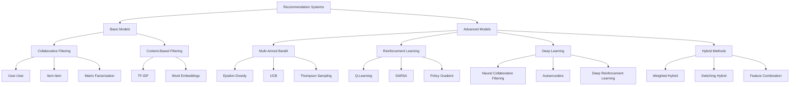

# RecSys

```mermaid
graph TD
    A["Recommendation Systems"]
    B["Basic Models"]
    C["Advanced Models"]
    D["Collaborative Filtering"]
    E["Content-Based Filtering"]
    F["Multi-Armed Bandit"]
    G["Reinforcement Learning"]
    H["Deep Learning"]
    I["Hybrid Methods"]

    A --> B
    A --> C
    B --> D
    B --> E
    C --> F
    C --> G
    C --> H
    C --> I

    D --> D1["User-User"]
    D --> D2["Item-Item"]
    D --> D3["Matrix Factorization"]

    E --> E1["TF-IDF"]
    E --> E2["Word Embeddings"]

    F --> F1["Epsilon-Greedy"]
    F --> F2["UCB"]
    F --> F3["Thompson Sampling"]

    G --> G1["Q-Learning"]
    G --> G2["SARSA"]
    G --> G3["Policy Gradient"]

    H --> H1["Neural Collaborative Filtering"]
    H --> H2["Autoencoders"]
    H --> H3["Deep Reinforcement Learning"]

    I --> I1["Weighted Hybrid"]
    I --> I2["Switching Hybrid"]
    I --> I3["Feature Combination"]
```
